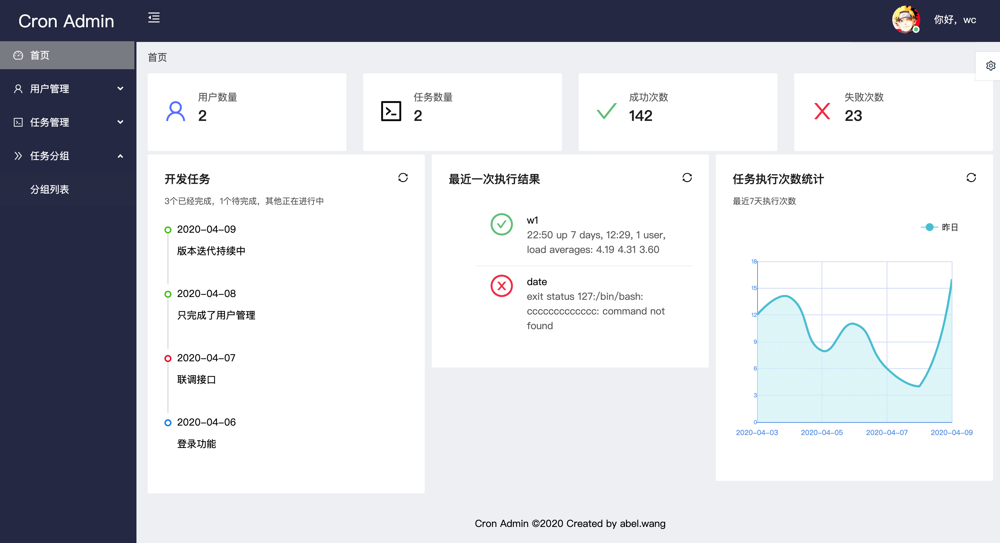
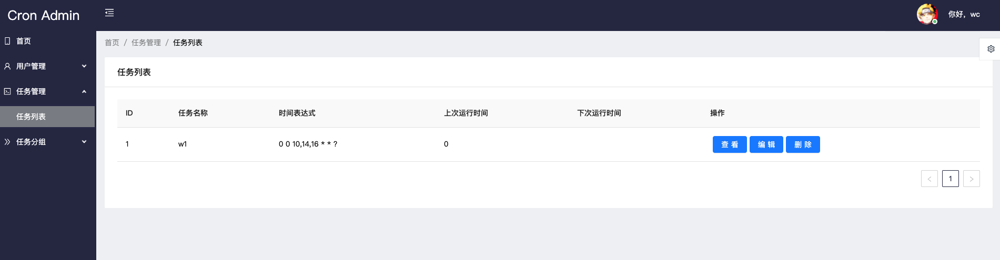
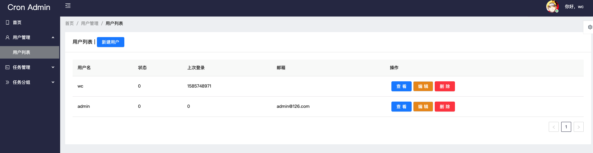
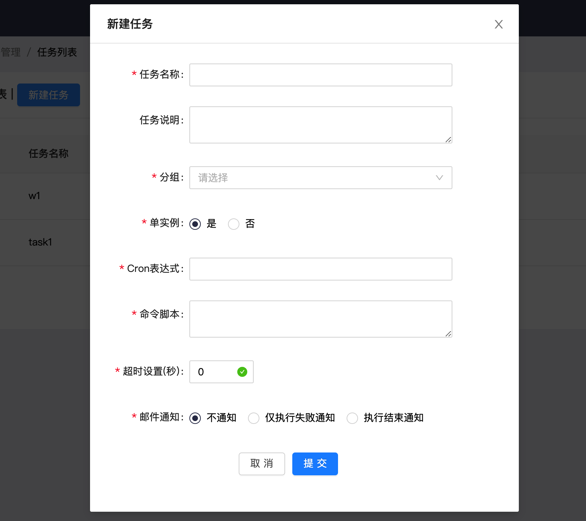

# cron admin
------------

一个定时任务后台管理器，基于Go语言和gin+grom框架开发。用于统一管理项目中的定时任务，提供可视化配置界面、执行日志记录、邮件通知等功能，无需依赖*unix下的crontab服务。

## demo
http://121.199.79.74:82/
* 用户名 admin
* 密码 123456
## 项目地址
* 前端: [react_cron](https://github.com/ntuwang/react_cron)
* 后端: [go_cron](https://github.com/ntuwang/go_cron)
## 项目背景
无

## 功能特点

* 统一管理多种定时任务。
* 秒级定时器，使用crontab的时间表达式。
* 可随时暂停任务。
* 记录每次任务的执行结果。
* 执行结果邮件通知。

## 界面截图

## 安装说明

系统需要安装Go和MySQL。

获取源码

	$ git clone https://github.com/ntuwang/go_cron
	
打开配置文件 conf/app.ini，修改相关配置。
	

创建数据库go_cron，再导入install.sql

	$ mysql -u username -p -D go_cron < install.sql

运行
	
	$go run main.go 

访问(前端)： 

http://localhost:8080

帐号：admin
密码：123456
